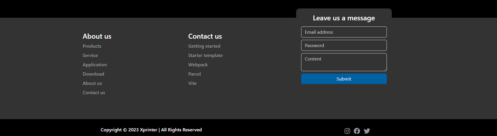

# Xprintertech the design was copied and updated

### Home page


### Product detail page


### Product list


### Mobile hamburger menu - triple action


### Footer



## Dark theme

### Dark home page


### Dark popular products


## Used

- [Bootstrap](https://getbootstrap.com/) - The most popular HTML, CSS, and JS library in the world.
- [Fancybox](http://fancybox.net/) - Fancy jQuery lightbox alternative
- [Hammerjs](https://hammerjs.github.io/) - Add touch gestures to your webapp
- [Swiperjs](https://swiperjs.com/) - The Most Modern Mobile Touch Slider
- [XZoom](https://payalord.github.io/xZoom/) - jQuery Zoom Gallery plugin

## Project structure

```
$PROJECT_ROOT
│   # Pages
├── resources/views/pages
│   # Layouts
├── resources/views/layouts
│   # Components
├── resources/views/components
│   # Main file
├── resources/views/app.blade.php
│   # Static files for images and packages
└── public
```

## License

MIT License.

Check out [LICENSE](./LICENSE) for more detail.

---
## Project setup


- #### These should be done first
```
cp .env.example .env

composer install && npm install

php artisan key:generate

```

- #### Watching sass
 ```
    npm run dev
 ```
- #### Build production
```
    npm run build
```
- #### Serve
```
php artisan serve
```
